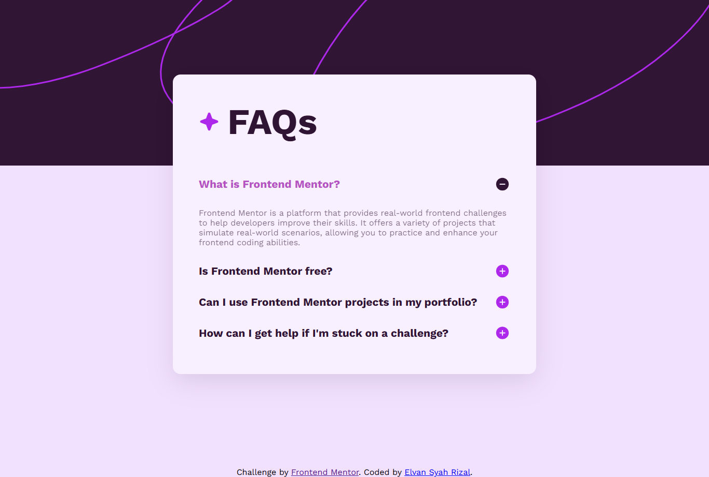

# Frontend Mentor - FAQ accordion solution

This is a solution to the [FAQ accordion challenge on Frontend Mentor](https://www.frontendmentor.io/challenges/faq-accordion-wyfFdeBwBz). Frontend Mentor challenges help you improve your coding skills by building realistic projects. 

## Table of contents

- [Overview](#overview)
  - [The challenge](#the-challenge)
  - [Screenshot](#screenshot)
  - [Links](#links)
- [My process](#my-process)
  - [Built with](#built-with)
  - [What I learned](#what-i-learned)
  - [Useful resources](#useful-resources)
- [Author](#author)

## Overview

### The challenge

Users should be able to:

- Hide/Show the answer to a question when the question is clicked
- Navigate the questions and hide/show answers using keyboard navigation alone
- View the optimal layout for the interface depending on their device's screen size
- See hover and focus states for all interactive elements on the page

### Screenshot




### Links

- Solution URL: [Add solution URL here](https://your-solution-url.com)
- Live Site URL: [Add live site URL here](https://your-live-site-url.com)

## My process

### Built with

- Semantic HTML5 markup
- CSS custom properties
- Flexbox
- CSS Grid
- JavaScript

### What I learned

Just learned JavaScript Accordion.

```js
function buttonOne() {
  var x = document.getElementById("answerOne");
  if (x.style.display === "none") {
    x.style.display = "block";
  } else {
    x.style.display = "none";
  }

  if (x.style.display === "block") {
    document.querySelector(".question-one img").src = "/assets/images/icon-minus.svg";
  } else {
    document.querySelector(".question-one img").src = "/assets/images/icon-plus.svg";
  }
}
```

### Useful resources

- [W3schools JS Accordion](https://www.w3schools.com/howto/howto_js_accordion.asp) - This helped me for accordion reference. I liked this cause it simple code and will use it going forward.

## Author

- Frontend Mentor - [@DragonRoar-dev](https://www.frontendmentor.io/profile/DragonRoar-dev)
- LinkedIn - [Elvan Syah Rizal](https://www.linkedin.com/in/elvansyahrizal/)
- Instagram - [Elvan Syah Rizal](https://www.instagram.com/elvansyhrzl/)
